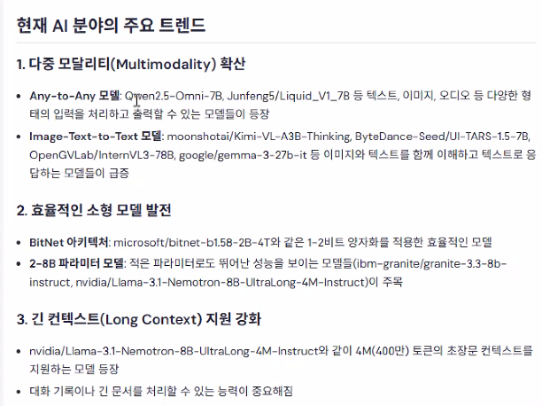

# 허깅페페이스

날짜: 2025년 4월 21일
공지: <숙제>

# 수업 개요

라마- 페이스북에서 만듬

open ai platform

# 허깅 페이스 불러오기

이미지 생성은 꼭 chat gpt 아니더라도 열 수 있어 

허깅페이스 - >모델 → Audio text to text etc 

현재 ai 분야의 주요 트랜드 

다중 모달리티 확산 

any to any 

image-text to text 모델 등등 

파인튜닝: 미세조정

토크나이저 데이터 들어오면 모델별로 사용하게끔 쪼개고 쪼개는 것들? 

10달러 주고 쓰는 것 

flux-1-dev 플럭스모델 와서 사이더에 사용 

허깅페이스 → 에서 이미지 제너레이션 눌러(?) 회사가 이렇게 쓴다 

# **복습하기**

Hugging Face 기본

[https://colab.research.google.com/drive/1S_rqVmjpE-VSap5NmiIGp7IfdTh2tGC-?usp=sharing](https://colab.research.google.com/drive/1S_rqVmjpE-VSap5NmiIGp7IfdTh2tGC-?usp=sharing)

CLIP 기본

[https://colab.research.google.com/drive/18GrDqCuiyw5aPicPvJLaRbSXv9qFxrwg?usp=sharing](https://colab.research.google.com/drive/18GrDqCuiyw5aPicPvJLaRbSXv9qFxrwg?usp=sharing)

필수 논문 읽고 : 개발능력이 어느정도 있어야 해 

플랫폼 만드는 사람이니 깊게 이해해야 한다.

### [실습]

- WhitePeak/bert-base-cased-Korean-sentiment의 모델을 활용하여 감정분석 실습을 해 보자.
- nlp04/korean_sentiment_analysis_kcelectra의 모델을 활용하여 감정분석 실습을 해 보자.

### 추가 설명

- "WhitePeak/bert-base-cased-Korean-sentiment"는 고객 리뷰 기반 한국어 감정 분석에 적합합니다.
- "nlp04/korean_sentiment_analysis_kcelectra"는 ELECTRA 기반으로, 한국어 텍스트에 강력한 성능을 보입니다.

### REF

- distilbert-base-uncased-finetuned-sst-2-english 모델 페이지([https://huggingface.co/distilbert-base-uncased-finetuned-sst-2-english](https://huggingface.co/distilbert-base-uncased-finetuned-sst-2-english))
- WhitePeak/bert-base-cased-Korean-sentiment 모델페이지([https://huggingface.co/distilbert-base-uncased-finetuned-sst-2-english](https://huggingface.co/distilbert-base-uncased-finetuned-sst-2-english))
- nlp04/korean_sentiment_analysis_kcelectra 모델 페이지([https://huggingface.co/nlp04/korean_sentiment_analysis_kcelectra](https://huggingface.co/nlp04/korean_sentiment_analysis_kcelectra))
- mrm8488/deberta-v3-ft-financial-news-sentiment-analysis 모델 페이지([https://huggingface.co/mrm8488/deberta-v3-ft-financial-news-sentiment-analysis](https://huggingface.co/mrm8488/deberta-v3-ft-financial-news-sentiment-analysis))

### 결론

이번 노트북에서는 Hugging Face의 다양한 사전 학습된 모델을 활용하여 감정 분석을 수행하는 방법을 학습했습니다. 주요 학습 성과는 다음과 같습니다:

1. **Hugging Face의 도구 사용법 이해**: Hugging Face의 `Transformers` 라이브러리와 `pipeline`을 사용하여 간단하게 감정 분석을 수행하는 방법을 익혔습니다.
2. **다양한 모델 비교**: 여러 NLP 모델(`DistilBERT`, `DeBERTa`, `BERT`, `RoBERTa` 등)을 사용하여 감정 분석을 수행하고, 모델별 성능을 비교해 보았습니다.
3. **언어별 모델 성능 차이 이해**: 영어와 한국어 텍스트에 대해 감정 분석 모델의 성능을 비교하고, 각 언어에 적합한 모델을 선택하는 것이 중요함을 배웠습니다.

### 추가적으로 탐구해볼 만한 주제

- **다양한 NLP 작업 적용**: 감정 분석 외에도 번역, 요약, 텍스트 생성 등 Hugging Face의 다양한 모델을 활용한 다른 NLP 작업에 대해 탐구.
- **모델 튜닝 및 커스터마이징**: 사전 학습된 모델을 특정 도메인에 맞게 튜닝하고 커스터마이징하는 방법을 연구.
- **다중 언어 지원**: 한국어를 포함한 다양한 언어에 대해 최적의 모델을 탐색하고 적용.

모두 수고하셨습니다. 열심히 해 주셔서 감사합니다.

# **파인튜닝을 직접해서 확인해보자엔지니어 쪽이 이정도는 해줘야 한다 .ㅠㅠ**

먼저 원리 파악 하면 쉽게 보인다. 

허깅페이스는 쳇 지피티 외에도 다른걸 사용할 수 있고 

지피티 사용 외에도 여기서 여러가지를 사용할 수 있다는 점을 알 수 있음. 

튜닝: 미세조정 ( 사전학습 모델 다운받아서 내 분야가 있다면 거기서 적절하게 맞추는거 → 그거에 따라 성능이 달라짐) 

# **기술검수+ 확인이 되야하는 시대**

클립- 멀티모달 - 이미지 인식

config. json 이 열려야 함 

얼리스탑핑, 히든 레이어 사이즈, 

AI 엔지니어 -허깅페이스 

욜로 8  실습코드 (gpt 등등 물어보기)

https://www.google.com/search?q=%ED%98%BC%EA%B3%B5%EB%A8%B8%EC%8B%A0&oq=%ED%98%BC%EA%B3%B5%EB%A8%B8%EC%8B%A0&gs_lcrp=EgZjaHJvbWUqCggAEAAY4wIYgAQyCggAEAAY4wIYgAQyBwgBEC4YgAQyBwgCEAAYgAQyBwgDEAAYgAQyBwgEEAAYgAQyBwgFEAAYgAQyBwgGEAAY7wUyCggHEAAYgAQYogQyCggIEAAYgAQYogTSAQkyNzc5ajBqMTWoAgiwAgHxBSsaI0SK5aDs&sourceid=chrome&ie=UTF-8

https://colab.research.google.com/drive/1FVa-F0rAuQ6ItoqQz9M8f13UmJgsMtZv?usp=sharing

https://platform.openai.com/docs/overview

[https://colab.research.google.com/drive/1FVa-F0rAuQ6ItoqQz9M8f13UmJgsMtZv?usp=sharing](https://colab.research.google.com/drive/1FVa-F0rAuQ6ItoqQz9M8f13UmJgsMtZv?usp=sharing)

커서 ai 컴포저 넥스트 js